# 计算机视觉期中作业报告

姓名：`刘翔宇`  
学号：`23307140078`    

## 任务一：基于 ImageNet 预训练模型的宠物品种识别

### 1. 任务目标

本任务使用 Oxford-IIIT Pet Dataset 完成 37 类宠物品种分类，并围绕以下四个问题展开：

1. 建立 `ResNet-18 + ImageNet 预训练` 的基线模型。
2. 通过消融实验验证预训练初始化的价值。
3. 分析学习率、batch size 和训练轮数对结果的影响。
4. 在基线模型上引入 `SE` 和 `CBAM` 注意力模块，观察其收益是否稳定。

### 2. 数据集与任务特点

Oxford-IIIT Pet Dataset 包含 37 个宠物品种，共 7,349 张图像。按照官方划分：

- 训练集：3,680 张
- 测试集：3,669 张
- 类别数：37

### 3. 实验设置

#### 3.1 模型与训练策略

基线模型采用 `ResNet-18`。该网络首先通过一个较大的卷积层与最大池化层提取底层纹理特征，然后依次经过 4 个残差 stage 提取更高层语义信息，最后通过全局平均池化和全连接层输出类别预测。残差连接的作用是让深层特征学习更加稳定，在参数规模不大的情况下仍能保留较强的表达能力，因此很适合作为本任务的分类 backbone。

对于预训练实验，骨干网络使用 ImageNet 权重初始化，分类头重新随机初始化。训练初期先冻结 backbone 1 个 epoch，避免分类头尚未适配时过快破坏已有特征，随后解冻全模型进行微调。

#### 3.2 默认训练配置

| 配置项 | 取值 |
| --- | --- |
| 模型 | ResNet-18 |
| 初始化 | ImageNet 预训练 |
| 输入尺寸 | 224×224 |
| batch size | 32 |
| epochs | 10 |
| learning rate | 3e-4 |
| optimizer | AdamW |
| weight decay | 1e-4 |
| scheduler | CosineAnnealingLR |
| 指标 | Accuracy |

实验中采用的数据增强策略：
- Resize后随机裁剪：先将图像resize到一个稍大的尺寸，然后随机裁剪出一个固定大小的区域。同一张图片每次裁剪的位置不同，迫使模型学会从不同的局部区域学习到关键特征，而非依赖位置信息。
- 轻量的颜色扰动：对图像的亮度、对比度、饱和度做微小的随机偏移。目的是模拟不同的光照条件、拍摄设备等带来的色彩差异，防止模型过度依赖某种特定的颜色分布。
- 归一化：$\frac{\text{pixel} - \text{mean}}{\text{std}}$，使得输入的像素值分布与与预训练模型在ImageNet上训练时一致

### 4. 实验结果

#### 4.1 Baseline

首先对 baseline 模型结果做简要说明：`ResNet-18 + ImageNet 预训练` 在本任务上能够稳定取得较高分类准确率，说明预训练特征对于宠物细粒度识别是有效的。从最终结果看，该模型已经具备较好的类别区分能力，可作为后续消融和超参数对比的统一参照。

| 实验名称 | 模型 | 预训练 | epochs | batch size | lr | best accuracy |
| --- | --- | --- | ---: | ---: | ---: | ---: |
| baseline_resnet18_pretrained | ResNet-18 | Yes | 10 | 32 | 3e-4 | 0.8743 |

| 训练损失 | 训练准确率 |
| --- | --- |
| 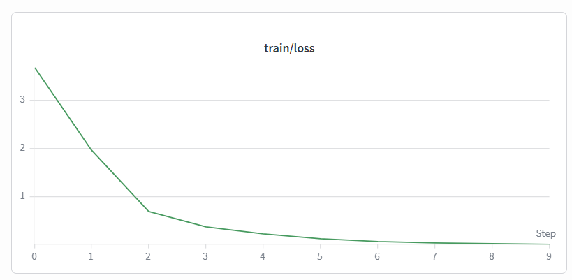 | 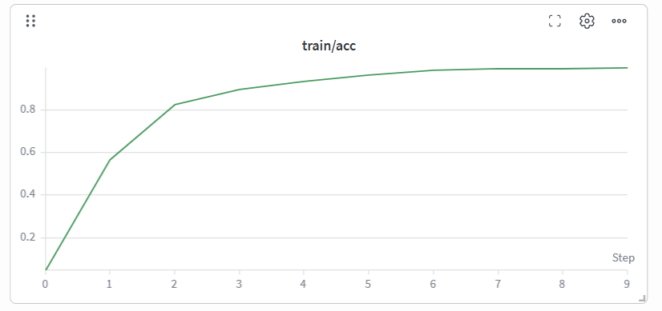 |

| 验证损失 | 验证准确率 |
| --- | --- |
| 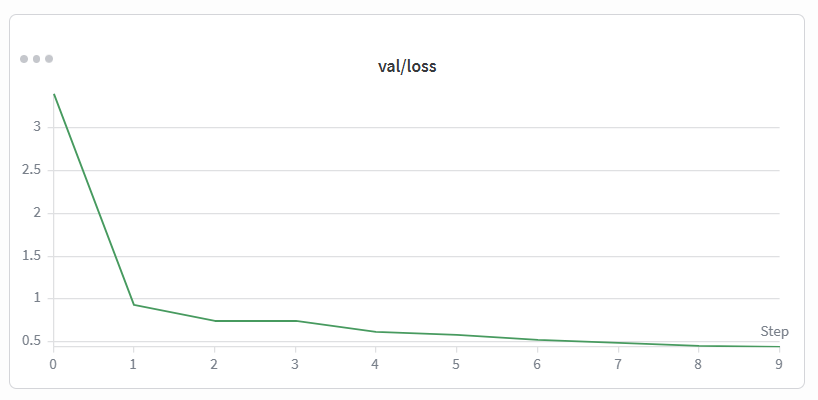 | 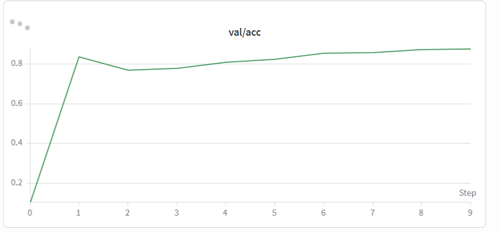 |

从训练曲线可以看到，模型在前几个 epoch 内快速收敛，约第 8 到 10 个 epoch 后验证准确率进入平台区。这说明对于当前数据规模，预训练 ResNet-18 已经能够较快学到有效判别特征，继续训练的边际收益有限。

#### 4.2 预训练消融

| 实验名称 | 初始化方式 | best accuracy |
| --- | --- | ---: |
| baseline_resnet18_pretrained | ImageNet 预训练 | 0.8743 |
| baseline_resnet18_scratch | 随机初始化 | 0.3667 |

| 训练过程对比 | 验证过程对比 |
| --- | --- |
| 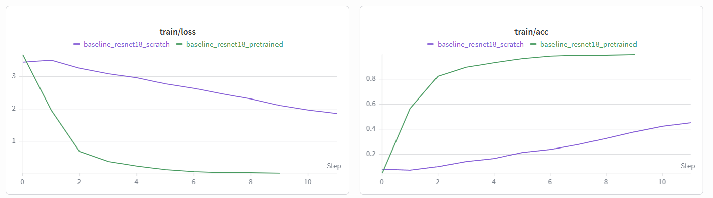 | 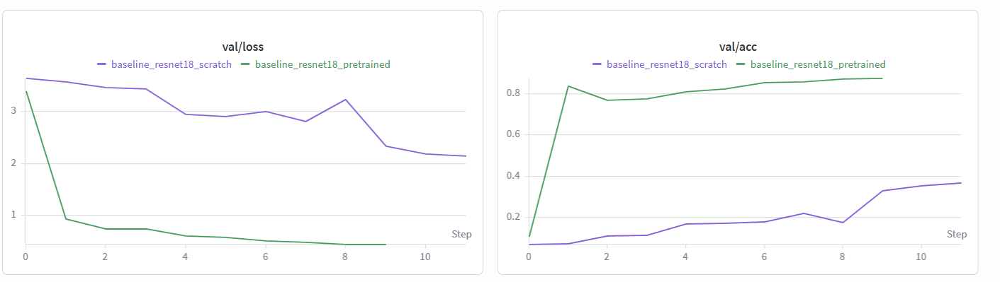 |

预训练模型相对随机初始化提升了 **50.76 个百分点**。这个差距非常大，说明在只有几千张训练图像的细粒度分类任务中，迁移学习不是“锦上添花”，而是决定模型是否可用的关键因素。

#### 4.3 超参数分析

##### 学习率

| 实验名称 | lr | batch size | epochs | best accuracy |
| --- | ---: | ---: | ---: | ---: |
| hparam_lr_1e3 | 1e-3 | 32 | 10 | 0.8410 |
| hparam_lr_3e4 | 3e-4 | 32 | 10 | 0.8743 |

##### Batch Size

| 实验名称 | lr | batch size | epochs | best accuracy |
| --- | ---: | ---: | ---: | ---: |
| hparam_bs16 | 3e-4 | 16 | 10 | 0.8606 |
| hparam_bs32 | 3e-4 | 32 | 10 | 0.8743 |

##### 训练轮数

| 实验名称 | lr | batch size | epochs | best accuracy |
| --- | ---: | ---: | ---: | ---: |
| hparam_ep10 | 3e-4 | 32 | 10 | 0.8743 |
| hparam_ep20 | 3e-4 | 32 | 20 | 0.8705 |

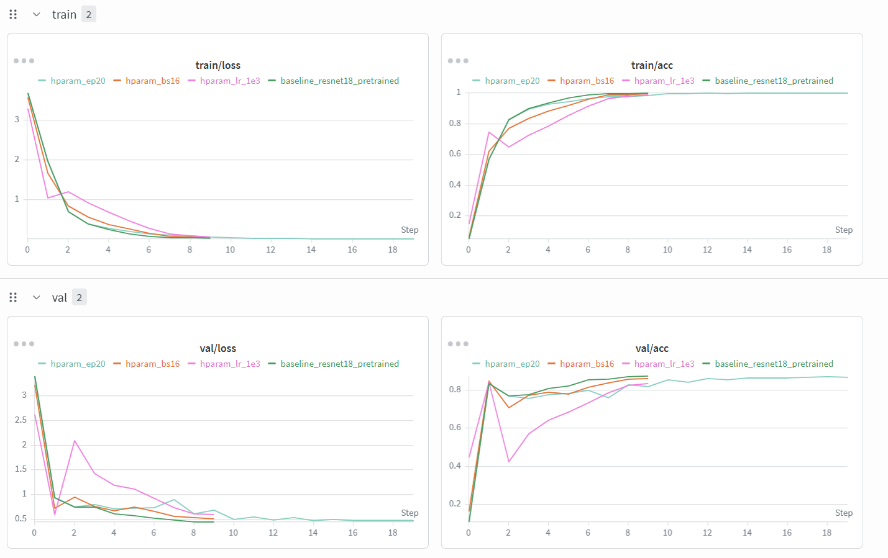
三组对比实验分析：

**学习率**：`3e-4` 比 `1e-3` 高出约 **3.3 个百分点**（0.8743 vs 0.8410），是三组超参数中影响最大的变量。这说明在微调场景中，学习率直接决定预训练权重被更新的幅度——过大的学习率会过快覆盖已学到的通用特征。

**Batch Size**：`bs=32` 比 `bs=16` 高约 **1.4 个百分点**（0.8743 vs 0.8606）。
较小的 batch 虽然引入了更强的梯度噪声，理论上有时有助于泛化，但在微调场景中，
预训练权重对更新方向较为敏感，同等学习率下小 batch 的梯度抖动更大，反而导致收
敛不稳定。此外，bs=16 时 BatchNorm 统计量估计也略差于 bs=32，这也会对最终精度
产生一定影响。总体来看，bs=32 在本任务中是更合适的选择。

**训练轮数**：增加到 20 个 epoch 后，最佳准确率反而从 0.8743 轻微下降到 0.8705，说明模型在 10 个 epoch 附近已经接近收敛。继续训练不仅没有收益，还出现了轻微过拟合。

综合来看，三个超参数中**学习率对最终结果的影响最显著**，batch size 次之，而增加训练轮数在当前设置下是无效的优化方向。推荐配置为 `lr=3e-4, bs=32, epochs=10`。

#### 4.4 注意力机制对比

这一部分仍以 `ResNet-18` 为主干网络，只是在残差模块中插入轻量注意力结构。`SE`（Squeeze-and-Excitation）主要在通道维度上学习“哪些特征通道更重要”；`CBAM`（Convolutional Block Attention Module）则在通道注意力之外进一步加入空间注意力，试图同时建模“哪些特征重要”和“图像哪些区域更重要”。因此，这组实验的目的并不是更换主干网络，而是观察轻量注意力模块能否增强模型对局部判别特征的关注能力。

| 实验名称 | 模型结构 | best accuracy |
| --- | --- | ---: |
| baseline_resnet18_pretrained | ResNet-18 | 0.8743 |
| resnet18_se | ResNet-18 + SE | 0.8640 |
| resnet18_cbam | ResNet-18 + CBAM | 0.8750 |

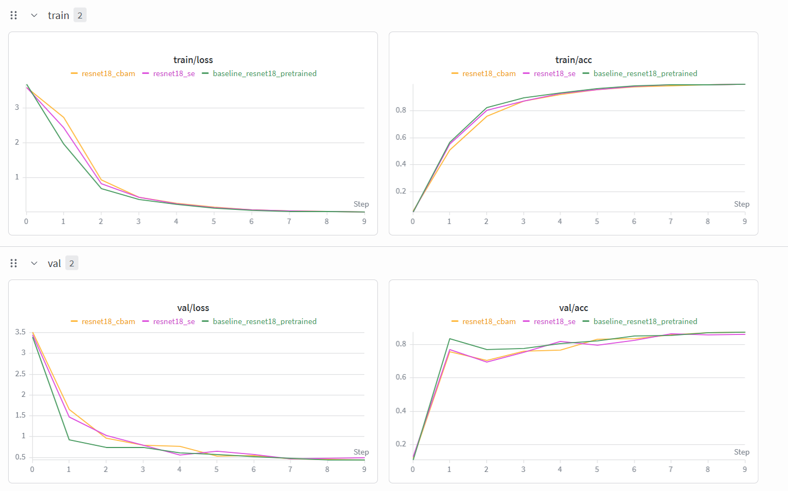

- **SE（Squeeze-and-Excitation）** 表现最差，`0.8640` 比 baseline 低了约 **1.0 个百分点**。SE 仅在通道维度上做注意力加权，本实验中它不但没有带来增益，反而使性能出现了可观测的下降。
- **CBAM（Convolutional Block Attention Module）** 取得了三组中的最高值 `0.8750`，但相对 baseline 的提升仅有 **0.07 个百分点**。
- 0.07 个百分点的差距（87.43% → 87.50%）属于单次实验的随机波动范围，不能排除初始化、数据 shuffle 顺序等因素的影响。

综上，在本任务的设定下，`SE` 和 `CBAM` 均未表现出对 baseline 的稳定提升：SE 明确劣于 baseline，CBAM 虽有微弱优势但不具备统计显著性。是否引入注意力模块，暂时不应作为优先优化方向。

### 5. 实验分析

#### 5.1 为什么预训练收益如此显著

本任务是典型的细粒度识别问题，类别之间共享大量共性，例如猫狗的整体轮廓、毛发纹理和背景场景。随机初始化模型需要同时学习“通用视觉特征”和“类别差异特征”，样本规模显然不足；而 ImageNet 预训练模型已经具备边缘、纹理、局部部件等中低层表征能力，微调阶段只需要把这些特征重新组合到宠物品种判别上，因此收敛速度和最终精度都明显更好。

#### 5.2 为什么学习率是最敏感的超参数

在微调场景中，学习率本质上控制“保留预训练知识”和“适配新任务”之间的平衡。`1e-3` 明显劣于 `3e-4`，说明较大的步长会更快破坏已经存在的通用表征，导致模型虽然训练损失下降，但泛化能力变差。相比之下，batch size 和训练轮数更多影响优化稳定性与过拟合风险，其对最终精度的影响没有学习率直接。

#### 5.3 为什么继续训练 20 个 epoch 收益很小

`ep20` 的最好结果为 `0.8705`，反而低于 `ep10` 的 `0.8743`。这说明模型在 10 个 epoch 左右已经完成主要收敛，继续训练不但没有带来收益，反而更可能开始放大对训练集细节的拟合，导致验证集表现轻微回落。对当前任务来说，增加训练轮数并不是有效优化方向。

#### 5.4 注意力模块没有带来明显增益的原因

注意力机制通常在更深网络、更大数据规模或更复杂上下文建模中更容易体现优势。当前任务使用的是轻量 `ResNet-18`，而且训练轮数有限，模型本身已经较快逼近可达到的性能上限。在这种情况下，额外加入 `SE/CBAM` 更可能带来优化负担，而不是显著提升特征表达。此外，宠物品种识别更依赖稳定的局部纹理和形状细节，轻量注意力并不一定能比原始卷积结构学到更有效的判别模式。

## 任务二：VisDrone 目标检测与视频多目标跟踪

### 1. 任务目标

本任务需要完成以下四项：

1. 在 VisDrone 数据集上微调单阶段目标检测模型。
2. 对 10 至 30 秒测试视频执行逐帧检测与多目标跟踪。
3. 选取遮挡/密集场景片段，分析 ID 保持与跳变原因。
4. 设置虚拟越线，完成基于 Tracking ID 的越线计数。

### 2. 数据集与场景特点

VisDrone2019-DET 是一个大规模无人机视角目标检测数据集，由中国天津大学发布。数据由无人机在不同城市、不同高度、不同天气条件下拍摄，总计 **8,629 张**训练/验证图像（含 6,471 张训练，548 张验证，1,610 张测试），覆盖 10 个常见交通参与类别：`pedestrian`、`people`、`bicycle`、`car`、`van`、`truck`、`tricycle`、`awning-tricycle`、`bus`、`motor`。

与常见的地面监控或自动驾驶数据集（如 COCO、KITTI）相比，无人机视角带来了四点根本性挑战：

1. **目标尺度过小**：由于拍摄高度通常在几十米到上百米，远距离车辆和行人仅占几十甚至几个像素。VisDrone 中大量目标属于 COCO 定义下的"小目标"范畴（< 32×32 像素），这使得定位和分类的难度远高于地面视角。
2. **密度高、遮挡严重**：单张图像平均包含数十个甚至上百个标注框，城市十字路口、停车场等场景中目标高度聚集，相互遮挡频繁。检测器不仅要面对高密度带来的 NMS 后处理压力，还要在重叠目标中准确区分不同实例。
3. **类间混淆加剧**：俯视视角消除了地面视角中常见的侧面轮廓和立体结构，`car`、`van`、`truck` 从正上方看差异极小，大幅增加了细粒度分类的难度。
4. **边缘目标频繁进出**：无人机运动导致画面边缘目标持续出现和消失，这对目标跟踪尤为致命——轨迹频繁断裂，ID 容易跳变。

### 3. 模型训练

#### 3.1 训练配置

| 配置项 | 取值 |
| --- | --- |
| 模型 | YOLO11n |
| 预训练 | `yolo11n.pt` |
| 参数量 | 2,591,790 |
| 输入尺寸 | 640×640 |
| batch size | 8 |
| epochs | 30 |
| optimizer | AdamW |
| 学习率策略 | Cosine |
| warmup | 3 epochs |
| 数据增强 | Mosaic、RandomFlip、RandAugment、HSV |

检测模型采用 `YOLO11n`，属于单阶段目标检测器。整体上可以分为 `backbone`、`neck` 和 `detect head` 三部分：backbone 负责提取图像特征，neck 负责融合不同尺度的特征图，以增强对小目标和大目标的同时检测能力，detect head 则在多尺度特征图上直接预测边界框和类别。`n` 版本是 YOLO11 系列中的轻量化配置，参数量较小、推理速度较快，适合作为本次课程作业中的基础检测模型。

#### 3.2 训练结果

| 指标 | 数值 |
| --- | ---: |
| Precision | 0.3839 |
| Recall | 0.3119 |
| mAP50 | 0.2734 |
| mAP50-95 | 0.1533 |
| train/box_loss | 1.4587 |
| val/box_loss | 1.4723 |

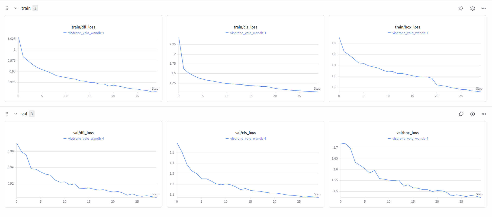

从结果看，模型已经学到了一定的检测能力，但整体 mAP 仍然偏低。这与 VisDrone 的任务难度一致：大量远距离小目标使得定位和分类都更困难，尤其是 mAP50-95 对框定位精度更敏感，所以值显得很低。

### 4. 视频多目标跟踪

#### 4.1 测试视频

| 属性 | 数值 |
| --- | --- |
| 文件 | `data/assignment2_vedio.mp4` |
| 分辨率 | 1280×720 |
| 帧率 | 20 fps |
| 总帧数 | 478 |
| 时长 | 23.9 秒 |

#### 4.2 跟踪配置

跟踪部分采用 `ByteTrack`。与需要额外外观特征提取的复杂多目标跟踪方法不同，ByteTrack 主要基于检测框的空间位置、置信度和 IoU 完成跨帧关联。它的核心特点是不会过早丢弃低置信度检测框，而是先用高分框更新轨迹，再利用低分框补充匹配未关联上的目标，因此对短时遮挡和轻微漏检有较好的鲁棒性。

| 配置项 | 取值 |
| --- | --- |
| 跟踪器 | ByteTrack |
| 检测置信度阈值 | 0.25 |
| IoU 阈值 | 0.5 |
#### 4.3 整体跟踪结果

| 指标 | 数值 |
| --- | ---: |
| 处理帧数 | 478 |
| 唯一 Track ID 数 | 194 |
| 平均轨迹长度 | 21.73 帧 |
| 平均轨迹时长 | 1.09 秒 |

跟踪结果视频：`assignment2/outputs/tracking/assignment2_vedio/tracked.mp4`

从整体结果看，系统已经能够在完整视频上稳定输出目标边界框、类别和跟踪 ID，说明检测与跟踪流程已成功跑通。但唯一 Track ID 数达到 194，平均轨迹长度仅为 21.73 帧（约 1.09 秒），表明轨迹碎片化现象较为明显。同一目标在遮挡、边缘区域或短时漏检情况下容易被分配新的 ID，因此当前系统的主要瓶颈不在跟踪算法本身，而在上游检测结果的稳定性上。

### 5. 遮挡与 ID 跳变分析

#### 5.1 片段选择

本节选取视频第 307-310 帧作为分析片段。选择该片段的原因是：该区域目标密集、边缘目标较多，并且在连续 4 帧中同时出现了目标消失、目标恢复和新 ID 生成的现象，因此适合分析 ByteTrack 在遮挡、漏检和密集场景下的关联行为
本节重点关注三个问题：

- 短时漏检后，跟踪器能否恢复原有 ID。
- 边缘低置信度目标为何容易断轨。
- 该片段中是否发生了真正的 ID switch，还是仅表现为轨迹碎片化。
#### 5.2 逐帧现象总结

在第 307 帧中，共检测到 14 个目标；到第 308 帧，目标数下降到 10 个，741、827、833、892、893 消失，同时新增 427。第 309 帧中，741 恢复，新增 907，而 702 和 787 消失；第 310 帧中，787 恢复，同时新增 908。
从这 4 帧的变化可以看出，该片段中的主要现象并不是大规模 ID 混乱，而是以下三类局部问题：
- 一部分目标在短时漏检后恢复了原 ID；
- 一部分低置信度边缘目标在消失后未能恢复；
- 个别区域出现了新 ID 与旧 ID 并存的情况，表现出一定轨迹碎片化倾向。

#### 5.3 短时遮挡与轨迹恢复
741 和 787 是本片段中最典型的“短时丢失后恢复”案例。
- 741 在第 307 帧出现，第 308 帧消失，第 309 帧重新以原 ID 出现；
- 787 在第 308 帧存在，第 309 帧消失，第 310 帧恢复原 ID。
这说明 ByteTrack 的轨迹缓存机制在短时漏检条件下是有效的。目标虽然在中间某一帧未被检测到，但由于丢失时间很短，下一帧重新出现时仍然能够匹配回原轨迹，而不是重新生成新的 ID。换句话说，该算法对“1 帧级别”的短时遮挡具有一定鲁棒性。
下面是787的例子：
在308帧存在：
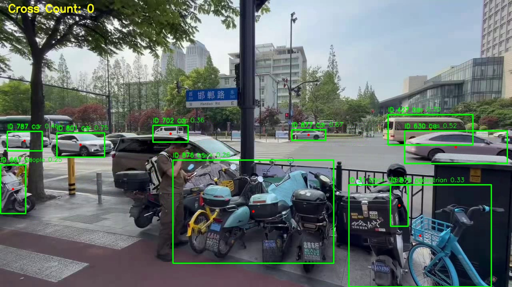
在309帧消失：
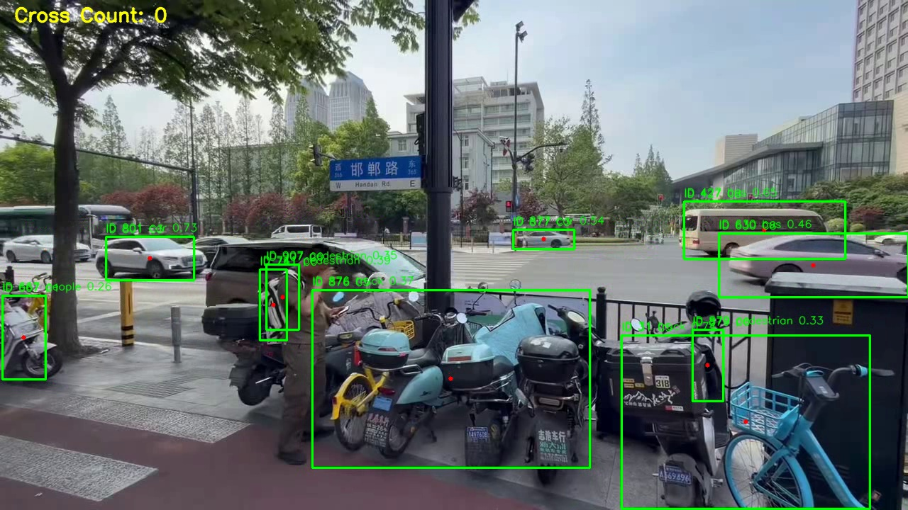
在310帧复现：
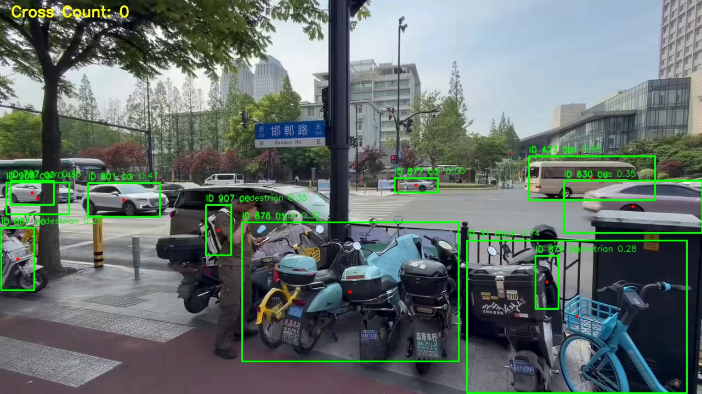
#### 5.4 边缘目标的断轨原因
892、893 都是在第 307 帧出现、随后消失且不再恢复的目标。这几个目标有两个共同特点：
- 置信度都偏低，大多在 0.27-0.49 之间；
- 位置靠近图像左右边缘

892 在下一帧已移出视频边界，它的轨迹终止属于正常现象，不是检测或跟踪的失败。这种情况在视频边界是不可避免的。
893 在仍在下一帧画面中，但该目标本身置信度较低，且可见区域不完整，因此在后续帧中未能被成功关联回原 ID，也没有生成新的 ID。
#### 5.5 漏检与新 ID 生成
- 427 并不是进入第308帧的新目标，而是在307帧中的漏检恢复
- 907 同样在帧 307 中已经出现，直到帧 309 才被检出，与 741 位置接近；
- 787 与 908 同时存在，同一个目标被分配了多个 ID

并没有观察到明显的"同一目标从旧 ID 切换到新 ID"的经典 ID switch，更多是检测质量不稳定引发的碎片化问题。

#### 5.6 类别抖动现象
除了 ID 变化，本片段还出现了类别预测不稳定的问题。例如 630 的类别从 car变为 bus，667 从 people 变为 pedestrian。这说明在密集、远距离或边缘区域，上游检测器不仅会出现漏检，还会出现类别抖动。类别预测的不稳定会进一步干扰跟踪器的关联判断，因此任务二的主要瓶颈依然在检测端，而不仅仅是跟踪算法本身。
类别识别问题例子：

这里类别识别错误，把四辆小车识别为一个`truck`。
ID 630的物体在307帧时被识别为`car`:

但在310帧时被识别为`bus`:

#### 5.7 结论
综合这 4 帧可以看出，ByteTrack 在短时遮挡场景下具备一定恢复原 ID 的能力，但对于边缘低置信度目标的持续关联能力较弱。在高密度区域，系统更常见的问题不是大规模 ID 交换，而是短时漏检、断轨和重复建轨。由此可见，本实验中影响跟踪稳定性的关键因素仍然是检测结果的波动，尤其是小目标、边缘目标和低置信度目标的检测质量。
### 6. 越线计数

#### 6.1 计数方法

在视频中央设置垂直虚拟线 `x = 640`。对每个 Track ID，记录目标中心点 `cx` 位于虚拟线左侧还是右侧；当同一目标在相邻帧中从一侧移动到另一侧时，记为一次越线。为了减少目标在直线附近轻微抖动造成的误计数，同一 Track ID 只统计一次越线事件。

#### 6.2 计数结果

| 指标 | 数值 |
| --- | ---: |
| 总 Track ID 数 | 194 |
| 自动越线计数 | 28 |
| 人工目测越线车辆数 | 约 40 |

越线结果视频：`assignment2/outputs/tracking/assignment2_vedio_line/tracked.mp4`

从人工复核结果看，视频中实际越线车辆数约为 `40`，而程序只统计到 `28`，少计约 `12` 辆，误差约为 `30%`。这说明当前越线计数模块虽然能够完成基本统计，但仍存在较明显的漏计问题，暂时还不能视为高精度的车辆流量统计结果。

造成漏计的原因主要有三点。第一，上游检测器对远距离小目标和低置信度目标的检测不稳定，部分车辆在接近中心线时发生短时漏检，导致轨迹在关键位置中断。第二，跟踪器在遮挡或密集区域可能出现断轨，使得某些车辆在真正跨线之前就已经失去连续轨迹，无法触发越线事件。第三，当前规则仅依据检测框中心点是否跨过 `x=640` 进行判断，如果检测框位置抖动较大，或者车辆虽然车身越线但中心点未明显跨线，也会导致漏计。

## 任务三：从零实现 U-Net 并比较不同损失函数

### 1. 任务目标

本任务围绕一个典型的语义分割问题展开，要求完成以下三项内容：

1. 从零搭建 U-Net，而不是直接调用现成分割模型。
2. 在 Oxford-IIIT Pet Dataset 的 trimap 标注上完成三分类分割训练。
3. 手动实现 Dice Loss，并与 Cross-Entropy、组合损失进行系统对比。

### 2. 模型结构设计

#### 2.1 U-Net 总体结构

本实验采用从零实现的标准 U-Net，整体结构由编码器、瓶颈层和解码器三部分组成：

| 组件 | 结构 |
| --- | --- |
| 编码器 | 4 层 DoubleConv (`3×3 Conv + BN + ReLU` × 2) |
| 下采样 | `MaxPool2d(2)` |
| 通道数 | 64 → 128 → 256 → 512 |
| 瓶颈层 | 1024 通道 DoubleConv |
| 解码器 | 4 层反卷积上采样 + Skip Connection + DoubleConv |
| 输出层 | `Conv2d(64, 3)` |

总参数量约为 **31.04M**。

#### 2.2 Skip Connection 的作用

U-Net 最关键的设计不是“下采样再上采样”本身，而是 skip connection。编码器浅层特征中保留了较多边缘、轮廓和局部结构信息，解码器则负责恢复空间细节。通过将对应层特征直接拼接，模型能够同时利用“高层语义”和“低层细节”。

对于本任务来说，这一点尤其重要。因为宠物边界本身非常细，如果仅依赖深层特征再逐层还原，边缘很容易变得粗糙甚至被背景吞并；而 skip connection 可以明显缓解这一问题。

#### 2.3 参数初始化

所有卷积层使用 Kaiming 初始化，BatchNorm 初始化为 `weight=1, bias=0`。整个模型不使用任何预训练权重，保证实验重点落在结构设计与损失函数比较本身，而不是迁移学习收益。

### 3. 数据集与预处理

#### 3.1 数据划分

在 `trainval` 集上进一步划分训练集和验证集，测试集保持官方划分：

| 集合 | 样本数 |
| --- | ---: |
| train | 2,944 |
| val | 736 |
| test | 3,669 |

所有输入图像统一缩放到 `256×256`。

#### 3.2 类别映射

| 原始 trimap 值 | 含义 | 训练标签 |
| --- | --- | ---: |
| 1 | 前景 | 0 |
| 2 | 背景 | 1 |
| 3 | 边界 | 2 |

背景像素占比远高于前景和边界，这也是本任务需要额外关注损失函数设计的根本原因。

#### 3.3 数据增强

- 训练集：随机水平翻转
- 验证/测试集：仅 Resize

这里只采用轻量增强，原因是分割任务对几何一致性要求较高，过强增强容易引入伪边界或破坏真实轮廓。

### 4. 损失函数设计

#### 4.1 Cross-Entropy Loss

$$
L_{CE} = -\sum_{c=1}^{C} y_c \log p_c
$$

Cross-Entropy 把每个像素看作独立分类样本，是最常见也最稳定的像素级损失函数。它的优点是优化过程成熟、梯度稳定，但缺点也很明显：当类别极不平衡时，损失更容易被大面积背景像素主导。

#### 4.2 Dice Loss

$$
L_{Dice} = 1 - \frac{1}{C}\sum_{c=1}^{C}\frac{2|P_c \cap G_c| + \epsilon}{|P_c| + |G_c| + \epsilon}
$$

Dice Loss 不再逐像素看待错误，而是直接从“预测区域与真实区域重叠程度”的角度进行优化。它天然更关注区域完整性，因此通常对少数类、边界类和小区域预测更友好。

#### 4.3 Combined Loss

$$
L_{Combined} = 0.5 \cdot L_{CE} + 0.5 \cdot L_{Dice}
$$

组合损失试图兼顾两者优点：保留 Cross-Entropy 的稳定优化能力，同时利用 Dice 强调区域重叠和类别平衡。它的目标不是取代二者，而是在训练中同时约束“像素级分类正确性”和“整体区域形状一致性”。

### 5. 实验设置

| 配置项 | 取值 |
| --- | --- |
| 模型 | U-Net (`base_filters=64`) |
| 初始化 | Kaiming |
| 输入尺寸 | 256×256 |
| batch size | 8 |
| epochs | 50 |
| optimizer | AdamW |
| learning rate | 1e-3 |
| scheduler | CosineAnnealingLR |
| 指标 | mIoU |

三组实验仅损失函数不同，其余设置完全一致，保证对比公平。

### 6. 实验结果

#### 6.1 验证集结果
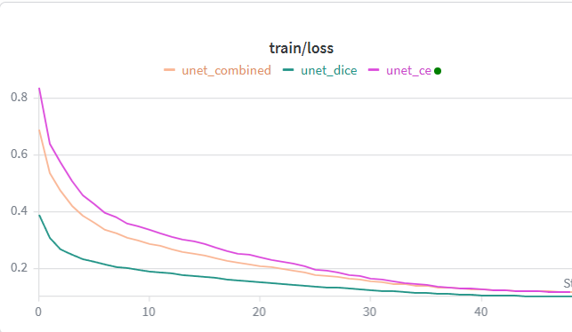
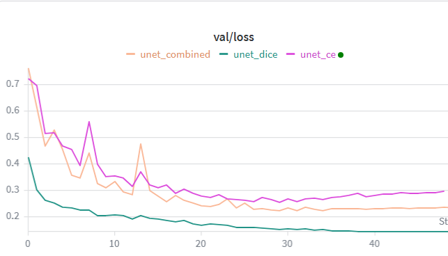
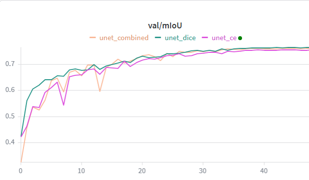

| 损失函数 | 最佳 epoch | 最佳 val mIoU | 最终 val mIoU |
| --- | ---: | ---: | ---: |
| Cross-Entropy | 46 | 0.6391 | 0.6290 |
| Dice Loss | 48 | 0.7654 | 0.7648 |
| Combined | 44 | 0.7618 | 0.7607 |

从验证集结果看，三组模型都能够完成基本分割任务，但在固定网络结构和训练配置不变的条件下，不同损失函数带来的性能差异非常明显。`Cross-Entropy` 的最佳验证集 mIoU 为 `0.6391`，而 `Dice` 和 `Combined` 分别达到 `0.7654` 和 `0.7618`，二者相对 CE 分别提升约 `0.126` 和 `0.123`。

这一结果说明：对于当前三分类分割任务，损失函数的选择会显著影响模型在验证集上的表现，尤其会影响模型对前景区域和边界区域的学习效果。不过，这里更准确的结论应当是“在相同 U-Net 结构下，损失函数设计是影响结果的重要因素之一”，而不能直接据此推出它与网络结构本身具有完全同等的重要性，因为本实验并未对不同分割网络结构进行控制变量比较。

#### 6.2 测试集结果

测试集评估结果如下：

| 损失函数 | pet | background | boundary | mIoU |
| --- | ---: | ---: | ---: | ---: |
| Cross-Entropy | 0.7340 | 0.8409 | 0.3576 | 0.6442 |
| Dice Loss | 0.7865 | 0.8843 | 0.5115 | 0.7274 |
| Combined | 0.8406 | 0.9137 | 0.5612 | 0.7718 |

从测试集结果看，`Combined` 取得了最高 mIoU `0.7718`，明显优于 `Dice` 的 `0.7274` 和 `CE` 的 `0.6442`。进一步看各类别 IoU，`Combined` 在前景、背景和边界三类上都取得了当前实验中的最好结果，尤其在前景类和边界类上的提升更为明显。这表明在本次实验设置下，组合损失相比单独使用 CE 或 Dice 具有更好的整体泛化表现；不过更合理的结论应当是，它在当前数据集和训练配置下效果最好，而不是简单认为组合损失在所有分割任务中都必然更优。

### 7. 分析与讨论

#### 7.1 不同损失函数带来的差异

从验证集和测试集结果可以看出，三种损失函数学到的优化重点并不相同。`CE` 的整体表现最弱，说明仅依赖逐像素分类误差不足以支撑当前任务；`Dice` 在验证集上取得最高峰值，说明它对区域重叠的优化最直接；`Combined` 虽然验证集峰值略低于 Dice，但在测试集上表现最好，说明它在泛化阶段更稳定。

这一现象说明，本任务中的性能差异并不是由网络结构变化造成的，而是由损失函数改变了模型的学习重点。换句话说，模型“更关注哪些像素、哪些区域、哪些错误”并不是固定的，而是会被损失函数直接塑造。

#### 7.2 为什么 Cross-Entropy 表现最弱

`Cross-Entropy` 的主要问题在于：它把每个像素都当作独立分类样本处理，而本任务中背景像素占比极高。这样一来，模型只要把大面积背景预测正确，就能获得较大的损失下降；相比之下，前景和边界区域即使预测不够理想，对总体损失的影响也相对有限。

这会带来两个直接后果：

1. 模型更容易优先学习背景，而不是前景轮廓；
2. 对边界这种本来就模糊、像素数又少的类别，优化力度明显不足。

从测试集结果也能看出这一点：`CE` 的 `boundary IoU` 只有 `0.3576`，远低于 `Dice` 和 `Combined`。这说明它并不是“完全不能分割”，而是容易得到一种“主体大致正确、边界明显变差”的结果。

#### 7.3 为什么 Dice 在验证集上更强

`Dice Loss` 直接面向预测区域和真实区域的重叠程度进行优化，因此它天然更重视区域完整性，而不是单个像素的分类是否正确。对于当前这种类别不平衡、边界敏感的任务，这种优化目标与 `mIoU` 更一致，所以 Dice 在验证集上表现最突出是合理的。

更具体地说，Dice 的优势主要体现在两点：

1. 它不会天然偏向像素数更多的背景类；
2. 它会更明显地惩罚前景缺失、边界断裂这类区域级错误。

因此，Dice 更容易学到“轮廓更完整、区域更连贯”的分割结果，这也是它能把验证集 mIoU 直接提升到 `0.7654` 的原因。

#### 7.4 为什么 Combined 在测试集上最好

本实验中最值得讨论的现象是：验证集峰值最高的是 `Dice`，但测试集最佳结果却来自 `Combined`。这说明“验证集局部最优”并不一定等于“最终泛化最好”。

更合理的理解是，`Combined` 同时继承了两类信息：

1. `CE` 提供了较稳定的像素级分类约束；
2. `Dice` 提供了对区域重叠和少数类的额外关注。

因此，`Combined` 不是简单地取两者平均，而是在训练过程中兼顾了“分类稳定性”和“区域一致性”。在验证集上，它没有超过 Dice 的最高峰值；但在测试集上，它在前景、背景和边界三类上都取得了最好结果，说明它学到的分割策略更均衡，也更具泛化性。

### 附录
GitHub代码仓：
模型权重见Google Drive：https://drive.google.com/file/d/1wbY2RR8hgROwkjlkFiYybVfzaH5w0VvK/view?usp=drive_link